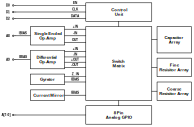

# SSCS Chipathon 2025 CreActive Team Repository

This repository is the CreActive team project for the SSCS Chipathon 2025 MOSbius track. We propose a topic on active filter building blocks which are configurable to construct variety of filter topologies.

## Project Overview

The initial idea of this project is to explore the possibility of translating filter transfer functions into an analog circuit through programming. Due to time constraints, we propose a simple prototype of this idea — namely, a MOSbius-style chip consisting of several op-amps, current mirrors, an array of passive components, and gyrators. Each of the op-amp terminals are connected to a switch matrix for internal routing and connection to analog GPIO. The filter charactheristic could be altered by programming the passive arrays or by adding external passive components. The frequency of operation is targeted to be around kilohertz range.

The circuit blocks in the design are listed below:
- 3x Single ended op-amp
- 3x Differential output op-amp
- 3x Gyrator
- 6x Current mirror
- Array of 1000 Ohm unit resistor
- Array of 10000 Ohm unit resistor
- Array of 100 fF unit capacitor

The overall design is shown on the block diagram below:

## Specifications

Operational Amplifier:
| Parameter | Value | Unit |
| :--- | :---: | :---: |
| **Supply Voltage** | 5 | V |
| **Input Voltage Range** | 0 - 5 | V |
| **Unity Gain Frequency** | 10 | MHz |
| **Open Loop Gain** | > 40 | dB |

> 🚧 **Work in progress** 

