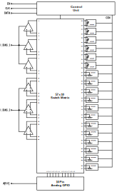

# SSCS Chipathon 2025 CreActive Team Repository

This repository is the CreActive team project for the SSCS Chipathon 2025 MOSbius track. We propose a topic on active filter building blocks which are configurable to construct variety of filter topologies.

## Project Overview

The initial idea of this project is to explore the possibility of translating filter transfer functions into an analog circuit through programming. Due to time constraints, we propose a simple prototype of this idea — namely, a MOSbius-style chip consisting of several op-amps, current mirrors, and arrays of passive component. Each of the op-amp terminals are connected to a switch matrix for internal routing and connection to analog GPIO. The filter charactheristic could be altered by programming the passive arrays or by adding external passive components. The frequency of operation is targeted to be around kilohertz range.

The circuit blocks in the design are listed below:
- 3x Single ended OTA
- 3x Differential output OTA
- 6x Array of 1k Ohm unit resistor
- 6x Array of 10k Ohm unit resistor
- 6x Array of 1 pF unit capacitor

The overall design is shown on the block diagram below:

## Quick Links
- [Github Issue on Chipathon Repository](https://github.com/sscs-ose/sscs-chipathon-2025/issues/67)
- [Progress Tracker](https://docs.google.com/spreadsheets/d/1_3lQBcbkPWE0qjfvSXVyYYxNycXKxWRLHg75SAif4VQ/edit?gid=0#gid=0)
- [Schematic and Simulation Slide](https://docs.google.com/presentation/d/1U_Cjjdl3jaWu9fqJNGk9T2up9zVVnG0BKYsYs8uDcsg)
- [Pin Map](https://docs.google.com/spreadsheets/d/1_3lQBcbkPWE0qjfvSXVyYYxNycXKxWRLHg75SAif4VQ/edit?gid=530173844#gid=530173844)
- [Area Estimation](docs/layout/README.md)

## Schematics and Target Specifications

### Single Ended OTA

| Parameter | Value | Unit |
| :--- | :---: | :---: |
| **Supply Voltage** | 3.3 | V |
| **Input Voltage Range** | 0 - 3.3 | V |
| **Unity Gain Frequency** | 10 | MHz |
| **Open Loop Gain** | > 40 | dB |

### Differential Output OTA

| Parameter | Value | Unit |
| :--- | :---: | :---: |
| **Supply Voltage** | 3.3 | V |
| **Input Voltage Range** | 0 - 3.3 | V |
| **Unity Gain Frequency** | 10 | MHz |
| **Open Loop Gain** | > 40 | dB |

### Capacitor Array

### Resistor Array

## Pin Diagram

### Internal Pin

The detailed block diagram of the project is shown on the figure below. All of the circuit blocks are connected to the switch matrix row internal pins (annotated with numbers 1-39), while the GPIOs are connected to the column internal pins (A0-A9).

### External Pin

| Pin Type | IO Name | Main Function | Notes |
| :--- | :---: | :---: | :---: |
| **VDD** | VDD | 3.3 V Supply | |
| **VSS** | VSS | Ground | |
| **Digital** | DATA | Digital Input| |
| **Digital** | CLK | Digital Input| |
| **Digital** | RSTN | Digital Input| |
| **Analog** | A[0] | Analog GPIO| Connected to 39 x 10 switch matrix |
| **Analog** | A[1] | Analog GPIO| Connected to 39 x 10 switch matrix |
| **Analog** | A[2] | Analog GPIO| Connected to 39 x 10 switch matrix |
| **Analog** | A[3] | Analog GPIO| Connected to 39 x 10 switch matrix |
| **Analog** | A[4] | Analog GPIO| Connected to 39 x 10 switch matrix |
| **Analog** | A[5] | Analog GPIO| Connected to 39 x 10 switch matrix |
| **Analog** | A[6] | Analog GPIO| Connected to 39 x 10 switch matrix |
| **Analog** | A[7] | Analog GPIO| Connected to 39 x 10 switch matrix |
| **Analog** | A[8] | Analog GPIO| Connected to 39 x 10 switch matrix |
| **Analog** | A[9] | Analog GPIO| Connected to 39 x 10 switch matrix |

## Switch Matrix Programming
The switch matrix has 57 rows and 10 column busses, resulting in 570 number of switch cells. To control the value of passive arrays, another 18 rows of switch cell were added. The bit stream data has the size of 75 x 10 and illustrated on the table below.

| Row Number | Description | 
| :--- | :---: |
| **1 ~ 57** | Switch Matrix (Internal Pin Connection) |
| **58 ~ 63** | 10 x 1pF Capacitor Array Control Data |
| **64 ~ 69** | 10 x 1k Ohm Resistor Array Control Data |
| **70 ~ 75** | 10 x 10k Ohm Resistor Array Control Data |

> 🚧 **Work in progress** 

