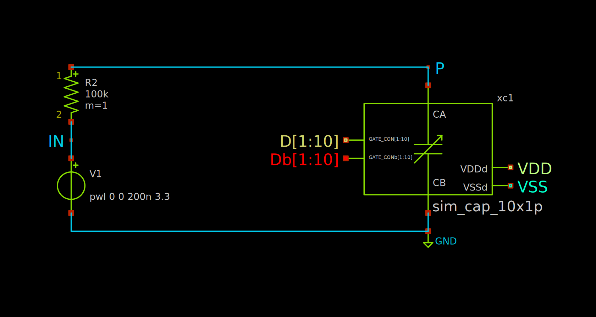

# Simulation Documentation

## Block Level Simulation

### Single-Ended OTA
The single-ended OTA used is a two-stage miller compensated OTA. Simulation and sizing both use a 30 pF capacitor load. The sizing script can be found [here](https://github.com/assaify/creactive-chipathon-2025/blob/main/designs/program/sizing-two_stage_ota.ipynb).
#### Test Bench:

#### Frequency Response:

#### Simulation Result:
| Parameter | Value | Unit |
| :--- | :---: | :---: |
| **Low Frequency Gain** | 82.936 | dB |
| **Unity Gain Frequency** | 10.182 | MHz |
| **Phase Margin** | 86.547 | deg |

### Differential Output OTA
The differential-output OTA used is a two-stage miller compensated OTA. Simulation and sizing both use a 30 pF capacitor load. The sizing script can be found [here](https://github.com/assaify/creactive-chipathon-2025/blob/main/designs/program/sizing-two_stage_ota.ipynb).
#### Test Bench:

#### Frequency Response:

#### Simulation Result:
| Parameter | Value | Unit |
| :--- | :---: | :---: |
| **Low Frequency Gain** | 62.899 | dB |
| **Unity Gain Frequency** | 8.391 | MHz |
| **Phase Margin** | 72.603 | deg |

### 10 x 1 pF Capacitor Array
#### Test Bench:

#### Measured Capacitance:

### 10 x 1 kΩ Resistor Array
#### Test Bench:

#### Measured Resistance:

### 10 x 10 kΩ Resistor Array
#### Test Bench:

#### Measured Resistance:

## Filter Simulation
The AC simulation was done using OTA and passive arrays that are connected in some filter topologies. Since the switch matrix needs transient simulation for programming, only the transmission gate was used at every pin connection to the bus. Each internal pin is labeled by "Px" and each bus is labeled by "GPIO_Ax".

### 2nd Order Sallen-Key Low Pass Filter
#### Test Bench:

#### Frequency Response:

### 2nd Order Sallen-Key High Pass Filter
#### Test Bench:

#### Frequency Response:

## Top-Level Schematic
The top-level schematic consists of 6 OTAs, 18 passive arrays, and a 10 x 57 switch matrix. The switch matrix was constructed using the 1 x 10 switch row from the [gf180mcu switch matrix repository](https://github.com/assaify/creactive-chipathon-2025/blob/main/designs/program/sizing-two_stage_ota.ipynb). The switch matrix block still needs to be redesigned, as currently it does not include the no-overlap clock generator and buffers.
